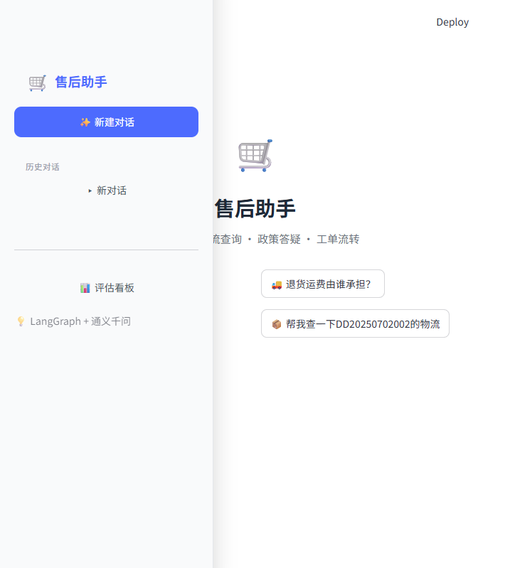

# 电商售后智能处理 Agent

基于 **LangGraph + 通义千问（Qwen）** 构建的电商售后智能客服系统，覆盖政策答疑、订单/物流查询、退换货处理、投诉安抚等核心售后场景，内置 RAG 知识库检索、多轮对话记忆、反幻觉校验、人工转接机制及全量评估套件。



---

## 功能特性

### 五大意图处理能力

| 意图 | 说明 | 处理方式 |
|------|------|----------|
| **政策答疑** (policy_qa) | 退换货政策、运费规则、质保期等咨询 | RAG 检索知识库 → 置信度判断 → LLM 生成回答 |
| **订单查询** (order_query) | 订单状态、物流轨迹查询 | 自动提取订单号 → 调用查询工具 → 结构化展示 |
| **退换货处理** (return_process) | 退货、换货、退款申请 | 订单校验 → 工单创建 → 退款金额计算 |
| **投诉安抚** (complaint) | 用户情绪激动/投诉 | LLM 情绪安抚 → 自动转人工 |
| **超范围处理** (out_of_scope) | 非售后相关问题 | 礼貌告知 → 引导至正确渠道 |

### 核心机制

- **感知-规划-执行-校验 工作流**：基于 LangGraph 构建，意图识别 → 条件路由 → 节点执行 → 结果校验 → 记忆更新
- **RAG 反幻觉机制**：知识库检索置信度低于阈值时拒绝回答并转人工，确保回答有据可依
- **多轮对话记忆**：滑动窗口（最近 6 条）+ 定期摘要压缩，平衡上下文完整性与 Token 消耗
- **人工转接策略**：意图置信度过低、检索不可靠、投诉情绪等场景自动转人工
- **SSE 流式输出**：支持 Server-Sent Events 流式响应，实时展示处理进度和逐字回答
- **工具前置校验**：订单查询/退换货前自动提取并校验订单号，缺失时主动追问
- **全量评估套件**：80 条测试用例，覆盖 5 大分类，支持问题解决率、拒答准确率等多维度评估

---

## 技术栈

| 层级 | 技术 | 说明 |
|------|------|------|
| **LLM** | 通义千问 (Qwen-Plus) | 通过 DashScope API 调用，支持流式输出 |
| **Embedding** | text-embedding-v2 | 通义千问向量嵌入模型 |
| **Agent 框架** | LangGraph | 工作流编排，状态图驱动 |
| **LangChain** | LangChain 0.3+ | 消息抽象、文档加载等基础设施 |
| **向量数据库** | ChromaDB | 本地持久化，售后政策文档检索 |
| **关系型数据库** | SQLite + SQLAlchemy 2.0 | 订单、工单、对话日志存储 |
| **后端框架** | FastAPI | 异步 HTTP API，支持 SSE 流式 |
| **前端** | Streamlit | DeepSeek 风格聊天界面 |
| **配置管理** | Pydantic Settings | .env 环境变量统一管理 |

---

## 项目结构

```
.
├── agent/                      # Agent 核心（LangGraph 工作流）
│   ├── graph.py                # 工作流图编排 + run_agent / run_agent_stream
│   ├── intent.py               # 意图识别（LLM + 结构化 Prompt）
│   ├── nodes.py                # 6 个处理节点实现
│   ├── memory.py               # 多轮记忆（滑动窗口 + 摘要）
│   └── state.py                # AgentState 状态定义
├── api/                        # FastAPI 服务层
│   ├── main.py                 # 应用入口 + 生命周期管理
│   ├── schemas.py              # 请求/响应模型
│   └── routes/                 # 路由（chat / orders / eval）
├── config/                     # 配置与模板
│   ├── settings.py             # 全局配置（.env 加载）
│   └── prompts.py              # 所有 Prompt 模板
├── database/                   # 数据库层
│   ├── models.py               # ORM 模型（Order / Ticket / ChatLog）
│   ├── connection.py           # 连接管理
│   └── init_db.py              # 初始化 + 种子数据
├── knowledge/                  # 知识库检索（RAG）
│   ├── document_loader.py      # Markdown 文档加载与分块
│   ├── vector_store.py         # ChromaDB 向量存储管理
│   └── retriever.py            # 检索器（Query Rewrite + 置信度评分）
├── llm/                        # LLM 客户端
│   └── qwen_client.py          # 通义千问封装（chat / chat_stream）
├── tools/                      # 售后工具集
│   ├── base.py                 # 工具基类
│   ├── order_query.py          # 订单查询工具
│   ├── logistics_query.py      # 物流查询工具
│   ├── refund_calc.py          # 退款金额计算工具
│   └── ticket_create.py        # 工单创建工具
├── evaluation/                 # 评估套件
│   ├── metrics.py              # 评估指标计算
│   ├── runner.py               # 评估运行器
│   └── test_cases.json         # 80 条测试用例
├── frontend/                   # Streamlit 前端
│   └── streamlit_app.py        # DeepSeek 风格聊天界面
├── data/                       # 数据目录
│   ├── knowledge_base/         # 售后政策文档（Markdown）
│   ├── seed/                   # 种子数据（订单 + 物流）
│   ├── chroma_db/              # ChromaDB 持久化
│   └── eval_reports/           # 评估报告
├── utils/                      # 通用工具
│   ├── exception.py            # 异常体系
│   └── logger.py               # 日志
├── tests/                      # 单元测试
├── main.py                     # 统一入口
├── requirements.txt            # 依赖
└── .env.example                # 环境配置模板
```

---

## 快速开始

### 1. 环境准备

```bash
# 克隆项目
git clone <repo-url>
cd E-commerce-After-sales-AI-Agent

# 安装依赖
pip install -r requirements.txt
```

### 2. 配置环境变量

```bash
# 复制配置模板
cp .env.example .env

# 编辑 .env，填入通义千问 API Key
# DASHSCOPE_API_KEY=your_actual_api_key
```

> API Key 获取：前往 [阿里云 DashScope](https://dashscope.console.aliyun.com/) 申请。

### 3. 初始化

```bash
python main.py init
```

该命令会：
- 创建 SQLite 数据库并写入种子订单/物流数据
- 加载 `data/knowledge_base/` 下的政策文档，构建 ChromaDB 向量索引

### 4. 启动服务

```bash
# 终端 1：启动后端 API（端口 8000）
python main.py server

# 终端 2：启动前端界面（端口 8501）
python main.py frontend
```

打开浏览器访问：
- **前端界面**：http://localhost:8501
- **API 文档**：http://localhost:8000/docs

---

## 使用说明

### 命令一览

```bash
python main.py init       # 初始化数据库 + 构建向量知识库
python main.py server     # 启动 FastAPI 后端服务（端口 8000）
python main.py frontend   # 启动 Streamlit 前端界面（端口 8501）
python main.py eval       # 运行全量评估测试集（80 条）
python main.py test       # 运行单元测试
python main.py help       # 显示帮助信息
```

### API 接口

| 方法 | 路径 | 说明 |
|------|------|------|
| `POST` | `/api/chat` | 对话接口（一次性返回） |
| `POST` | `/api/chat/stream` | 流式对话接口（SSE） |
| `GET` | `/api/chat/history/{session_id}` | 获取对话历史 |
| `GET` | `/api/orders/{order_id}` | 查询订单信息 |
| `POST` | `/api/eval/run` | 运行评估测试 |
| `GET` | `/api/eval/report` | 获取最新评估报告 |
| `GET` | `/health` | 健康检查 |

### 示例对话

```
用户：7天无理由退货怎么操作？
Agent：[检索知识库] 根据《退货政策》，7天无理由退货的操作流程如下...

用户：帮我查一下DD20250701001的物流
Agent：[调用物流查询工具] 您的订单物流信息如下：物流公司：顺丰...

用户：我想退货，订单号DD20250701001，商品有质量问题
Agent：[创建退换货工单 + 计算退款] 您的退货申请已受理！工单号：TK...

用户：你们这什么破东西！我要投诉！
Agent：[情绪安抚] 非常抱歉给您带来不好的体验...已为您转接人工客服。
```

---

## 评估套件

项目内置 80 条测试用例，覆盖 5 个分类：

| 分类 | 说明 | 用例数 |
|------|------|--------|
| `simple_qa` | 简单政策问答 | 20 |
| `multi_turn` | 多轮流程（退换货） | 20 |
| `ambiguous` | 歧义/模糊意图 | 15 |
| `knowledge_missing` | 知识库缺失场景 | 15 |
| `out_of_scope` | 超范围问题 | 10 |

**评估指标**：
- 问题解决率（Resolution Rate）
- 拒答准确率（Refusal Accuracy）
- 平均响应时长（Avg Response Time）
- 工具调用成功率（Tool Call Success Rate）
- 人工转接率（Human Handoff Rate）

```bash
# 命令行运行
python main.py eval

# 或通过 API
curl -X POST http://localhost:8000/api/eval/run

# 或在前端点击「评估看板」
```

---

## Agent 工作流

```
START → intent_recognition → route_by_intent
  ├→ policy_qa       → validate → memory_summary → END
  ├→ order_query                  → memory_summary → END
  ├→ return_process  → validate → memory_summary → END
  ├→ complaint                    → memory_summary → END
  └→ out_of_scope                 → memory_summary → END
```

每个节点执行后将结果写入共享的 `AgentState`，包含意图、置信度、槽位、检索文档、工具调用记录、工作流轨迹等完整信息，前端可展开查看 Agent 的完整推理过程。

---

## 配置项

所有配置通过 `.env` 文件管理，主要参数：

| 参数 | 默认值 | 说明 |
|------|--------|------|
| `DASHSCOPE_API_KEY` | — | 通义千问 API Key（必填） |
| `LLM_MODEL_NAME` | qwen-plus | LLM 模型名称 |
| `LLM_TEMPERATURE` | 0.3 | 生成温度 |
| `RETRIEVAL_TOP_K` | 3 | 检索返回文档数 |
| `RETRIEVAL_CONFIDENCE_THRESHOLD` | 0.65 | 检索置信度阈值（低于则转人工） |
| `INTENT_CONFIDENCE_THRESHOLD` | 0.7 | 意图置信度阈值 |
| `HUMAN_HANDOFF_THRESHOLD` | 0.5 | 人工转接置信度阈值 |
| `MEMORY_WINDOW_SIZE` | 6 | 滑动窗口大小 |
| `MEMORY_SUMMARY_INTERVAL` | 3 | 摘要触发间隔（轮） |
| `API_PORT` | 8000 | 后端服务端口 |
| `FRONTEND_PORT` | 8501 | 前端服务端口 |

完整配置项参见 [`.env.example`](.env.example)。

---

## 知识库

售后政策文档位于 `data/knowledge_base/` 目录：

| 文件 | 内容 |
|------|------|
| `return_policy.md` | 退换货政策（7天无理由、退货条件、时效等） |
| `shipping_policy.md` | 运费政策（运费承担规则、运费险等） |
| `warranty_policy.md` | 质保政策（质保期、保修范围等） |
| `insurance_policy.md` | 运费险政策（理赔条件、金额等） |

初始化时会自动加载并分块（chunk_size=500, overlap=50）后写入 ChromaDB。

---

## 开发

### 运行测试

```bash
# 单元测试
python main.py test

# 或直接使用 pytest
pytest -v tests/
```

### 项目依赖

- Python 3.10+
- LangGraph >= 0.2.0
- LangChain >= 0.3.0
- FastAPI >= 0.115.0
- Streamlit >= 1.38.0
- SQLAlchemy >= 2.0.0
- ChromaDB >= 0.5.0
- DashScope >= 1.20.0

---

## License

本项目仅供学习和参考使用。
